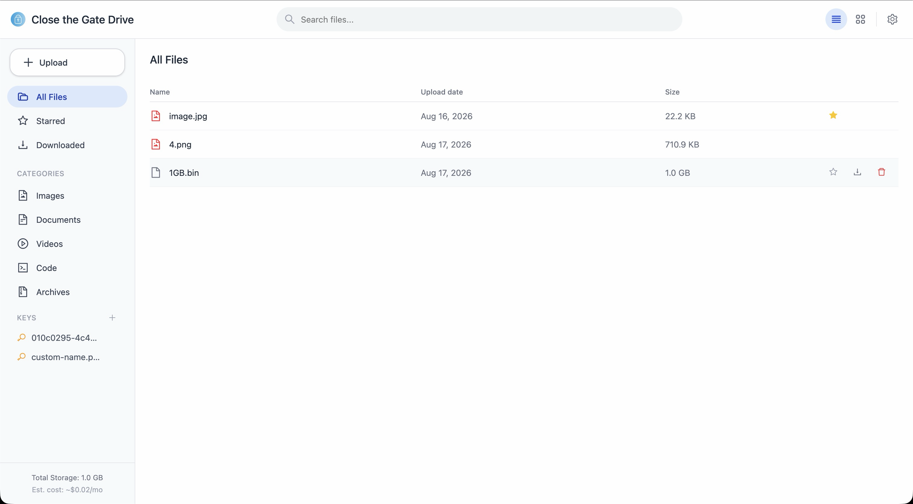
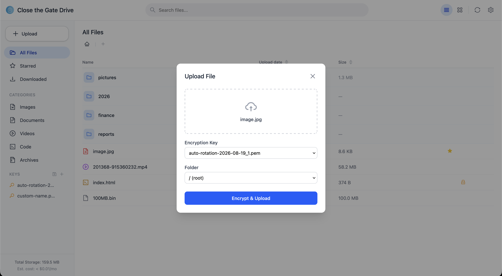
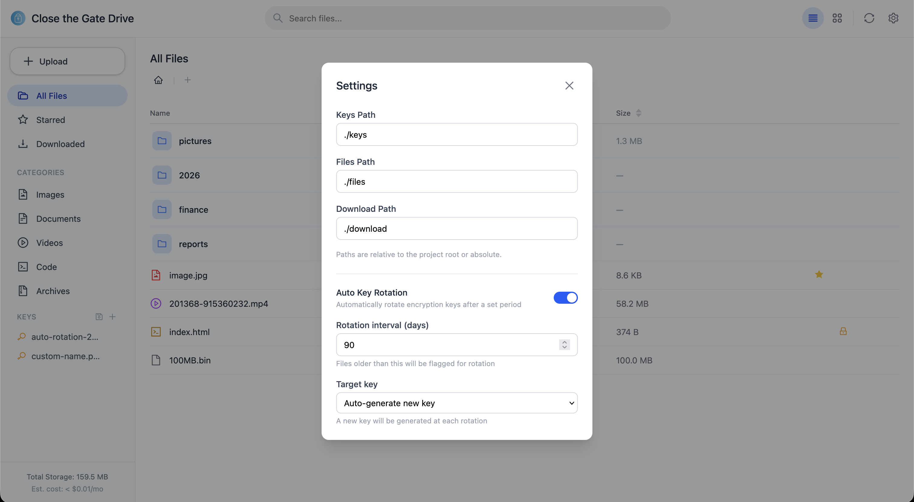
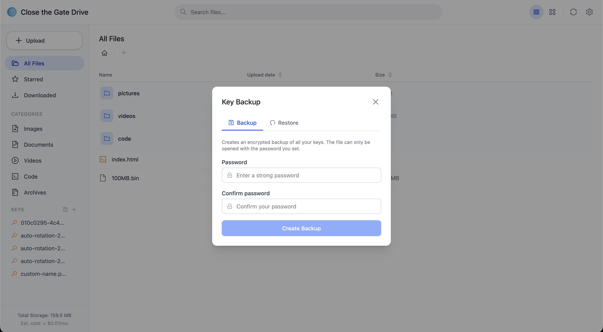
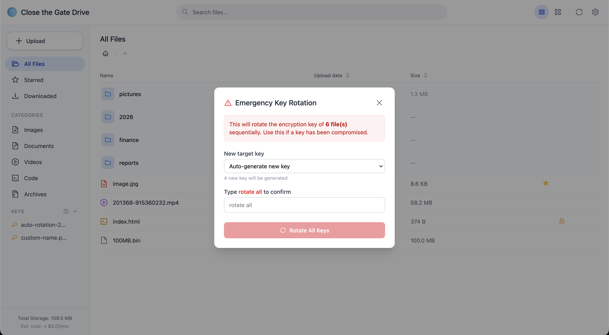
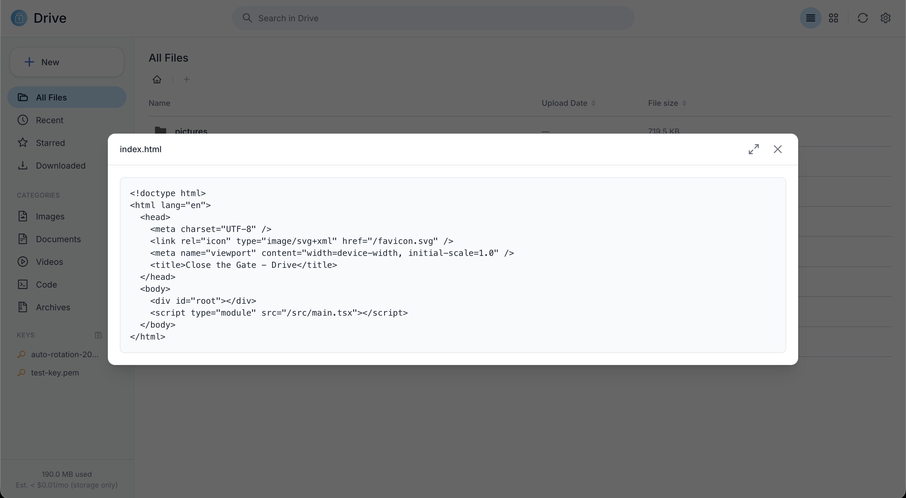
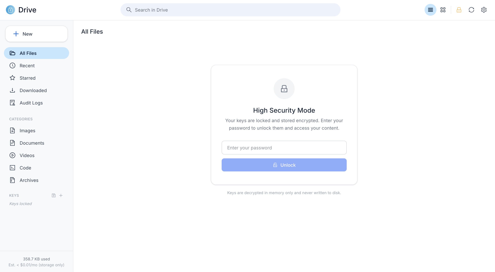

# Close the gate

<p>
  
</p>

A privacy-first software to upload encrypted-only files to AWS S3 while having full control and ownership over the keys and the encryption process.

It follows a strict Zero-Knowledge architecture: the cloud provider (AWS S3) and the database (DynamoDB) never have access to the raw data or the cryptographic keys.

All cryptographic operations (key generation, AES-256-GCM encryption, HMAC SHA-256 signing) are performed locally on the client/middleware side.

The software is developped using TypeScript over Node.js.

## Features Summary

- **AES-256-GCM encryption** with locally generated keys (mode 0600, never leave your machine)
- **Zero-Knowledge storage** — S3 stores only ciphertext, file names are HMAC SHA-256 hashed
- **In-memory file preview** — decrypt and view without writing to disk
- **Key rotation** — per-file, batch, emergency, or automatic with configurable intervals
- **High security mode** — keys encrypted at rest, decrypted in RAM only when unlocked
- **Password-protected key backup and restore** (PBKDF2 + AES-256-GCM)
- **Audit trail** — see every action done on your drive, protected from tampering
- **Web UI, CLI, and TypeScript SDK** — Google Drive-style interface with drag & drop, inline rename, context menu
- **Docker-ready** — deploy in one command

## Security & Compliance

Close the Gate follows a strict zero-knowledge model: all cryptographic operations happen client-side, and AWS never receives plaintext or key material. For a full analysis of trust boundaries and what the tool does and does not protect against, see [THREAT_MODEL.md](THREAT_MODEL.md).

The controls below map common compliance requirements to concrete features. This is an indication of how the tool supports these frameworks, not a certification.

| Requirement                                     | Frameworks                                                                    | How Close the Gate addresses it                                                    |
| ----------------------------------------------- | ----------------------------------------------------------------------------- | ---------------------------------------------------------------------------------- |
| Encryption of data at rest                      | SOC 2 (CC6.1), ISO 27001 (A.8.24), GDPR (Art. 32), HIPAA (§164.312(a)(2)(iv)) | AES-256-GCM client-side encryption; S3 stores only ciphertext                      |
| Encryption in transit                           | SOC 2 (CC6.1), ISO 27001 (A.8.24), HIPAA (§164.312(e)(1))                     | All AWS SDK calls use TLS                                                          |
| Customer-managed key ownership                  | SOC 2 (CC6.1), GDPR (Art. 28 — processor access)                              | Keys are generated and stored locally; the cloud provider is never a key custodian |
| Key rotation                                    | SOC 2 (CC6.1), ISO 27001 (A.8.24), PCI DSS (3.6.4)                            | Per-file, batch, emergency, and scheduled automatic rotation                       |
| Audit logging / traceability                    | SOC 2 (CC7.2), ISO 27001 (A.8.15), HIPAA (§164.312(b))                        | Every operation is appended to a tamper-evident HMAC hash-chained log              |
| Log integrity / tamper evidence                 | SOC 2 (CC7.2), ISO 27001 (A.8.15)                                             | Chain verification detects any modification or deletion of past entries            |
| Data minimization / confidentiality of metadata | GDPR (Art. 5(1)(c))                                                           | File names are HMAC-hashed before leaving the client                               |
| Secure key backup                               | ISO 27001 (A.8.24), NIST SP 800-57                                            | Password-protected backups using PBKDF2 (600k iterations, SHA-512) + AES-256-GCM   |
| Access protection for sensitive material        | SOC 2 (CC6.1), ISO 27001 (A.8.3)                                              | High Security mode keeps keys in RAM only, with inactivity wipe                    |

> **Note for reviewers:** these mappings describe application-level controls. A production deployment should be paired with AWS infrastructure controls (least-privilege IAM, S3 Object Lock, bucket policies denying non-TLS, CloudTrail). See the hardening recommendations in [THREAT_MODEL.md](THREAT_MODEL.md).

## Prerequisites

- Node.js (v22.0.0+).
- AWS Credentials configured locally (or via .env).

## Configuration

Create a `.env` file at the root of the project with your AWS configuration:

```
AWS_REGION=your-region
S3_BUCKET=your-bucket-name
DYNAMO_TABLE=your-table-name
```

## Installation

### Docker (recommended)

```bash
docker build -t close-the-gate .
docker run -d -p 3001:3001 --env-file .env -v ./keys:/app/keys -v ./template.config.json:/app/config.json close-the-gate
```

Then open `http://localhost:3001`.

Or with docker-compose:

```bash
docker compose up -d
```

### Manual

1. Install the dependencies:

```bash
npm install
```

2. Copy the template configuration file to `config.json`:

```bash
cp template.config.json config.json
```

3. Build the TypeScript project:

```bash
npx tsc
```

3. Link the CLI globally to use the `ctg` command system-wide:

```bash
npm link
```

## Usage

### 1. Web Interface

The simplest way to use Close the Gate. Launch the web UI with:

```bash
npm run web
```

Then open your browser at the indicated URL. From the interface you can manage your keys, upload, download, and delete encrypted files visually.

The web interface also provides:

- Real-time upload progress bar (transfer + server-side encryption + S3 upload)
- Virtual folder organization with breadcrumb navigation and drag & drop
- In-memory file preview with fullscreen mode (decrypted on the fly, never written to disk)
- Double-click to preview files, double-click to open folders
- Inline rename for files and folders (click on the name)
- Right-click context menu (create folder, upload file)
- Key rotation (per-file, batch, or emergency rotation for all files)
- Auto key rotation with configurable interval (Settings > Auto Key Rotation)
- High security mode: keys encrypted at rest, loaded into RAM only when unlocked
- Password-protected key backup and restore
- Per-file deletion protection (lock/unlock with confirmation)
- Sortable file list by date and size (list and grid view)
- Custom drag preview (icon + filename) for clean drag & drop UX



|         Upload with progress         |      Settings & auto rotation       |
| :----------------------------------: | :---------------------------------: |
|  |  |

|             Key backup              |             Emergency rotation             |
| :---------------------------------: | :----------------------------------------: |
|  |  |

|         In-memory file preview         |                 High security mode                 |
| :------------------------------------: | :------------------------------------------------: |
|  |  |

### 2. Command Line Interface (CLI)

Once linked, you can run `ctg` directly from your terminal.

#### Global Help

```bash
ctg --help
```

#### Generate a Key

Generates a new cryptographic key locally.

```bash
# Default (32 bytes key saved in /keys)
ctg generate-key

# Custom byte length, key name, and output path
ctg generate-key -b 64 -n my-secret-key -P /path/to/custom/dir
```

- **`-b, --bytes <number>`**: Key length in bytes (between 16 and 64, default: `32`).
- **`-n, --key-name <keyName>`**: Custom name for the key file (without extension).
- **`-P, --key-path <keyPath>`**: Custom directory path for the key.

#### Upload a File

Encrypts a file locally and uploads the encrypted payload to S3.

```bash
ctg upload-file -f example.txt -k my-secret-key.pem
```

- **`-f, --file <fileName>`** _(Required)_: Name of the file inside `/files`.
- **`-k, --key <keyName>`** _(Required)_: Name of the key inside `/keys`.
- **`-p, --dir-path <dirPath>`**: Custom path for the file directory.
- **`-P, --key-path <keyPath>`**: Custom path for the key directory.

#### Download a File

Downloads the encrypted file from S3 and decrypts it locally.

```bash
ctg download-file -f example.txt -k my-secret-key.pem
```

- **`-f, --file <fileName>`** _(Required)_: Name of the file to download.
- **`-k, --key <keyName>`** _(Required)_: Name of the key associated with the file.
- **`-p, --dir-path <dirPath>`**: Custom output path for the downloaded file.
- **`-P, --key-path <keyPath>`**: Custom path for the key directory.

#### Delete a File

Deletes the file from S3 and its associated metadata from DynamoDB.

```bash
ctg delete-file -f example.txt -k my-secret-key.pem
```

- **`-f, --file <fileName>`** _(Required)_: Name of the file to delete.
- **`-k, --key <keyName>`** _(Required)_: Key associated with the file.
- **`-P, --key-path <keyPath>`**: Custom path for the key directory.

#### Delete a Key

Deletes a local key file.

```bash
ctg delete-key -n my-secret-key.pem
```

- **`-n, --key-name <keyName>`** _(Required)_: Name of the key file to delete.
- **`-P, --key-path <keyPath>`**: Custom path for the key directory.

#### Backup Keys

Creates a password-protected encrypted backup of all keys.

```bash
ctg backup-keys -p "my-strong-password"
```

- **`-p, --password <password>`** _(Required)_: Password to encrypt the backup.
- **`-P, --key-path <keyPath>`**: Custom path for the keys directory.
- **`-o, --output <outputPath>`**: Custom output directory (default: keys directory).

The backup file (`.ctg-backup`) is encrypted with AES-256-GCM using a key derived from the password via PBKDF2 (600k iterations, SHA-512).

#### Restore Keys

Restores keys from a password-protected backup file.

```bash
ctg restore-keys -p "my-strong-password" -f ./keys/ctg-backup-2026-08-17.ctg-backup
```

- **`-p, --password <password>`** _(Required)_: Password used during backup.
- **`-f, --file <backupFile>`** _(Required)_: Path to the `.ctg-backup` file.
- **`-P, --key-path <keyPath>`**: Custom path for the keys directory.

### 3. Programmatic Usage (SDK / TypeScript)

You can also import and use the core classes (`Key` and `File`) directly in your Node.js code.

```typescript
import Key from './keys';
import File from './files';

const key = new Key();
const file = new File();
```

If you want to generate a key, define the bytes length of the key and utilize the .generate(bytes) method

```typescript
const bytes = 32; // must be between 16 and 64 bytes
key.generate(bytes);
```

If you want to retrieve an existing key, retrieve it via the .retrieve("key_name") method (the key need to be placed in the /keys folder at the root of the folder or you need to declare a specific path by adding it as a string in a second argument)

```typescript
key.retrieve('010c0295-4c46-4b70-8768-b1c4c461f72f.pem');
```

You can start working with your files (located in the /files folder at the root of the folder or you need to declare a specific path by adding it as a string in a second argument)

```typescript
file.upload('example.txt', key);
file.download('example.txt', key);
file.delete('example.txt', key);
```

You always have to pass the fileName as the first parameter and the key object as the second parameter. Don't forget to call key.retrieve("key_name.pem") before you download or delete a file associated with this relevant key. You can also add a third parameter to define a custom file path for the upload and download methods.
